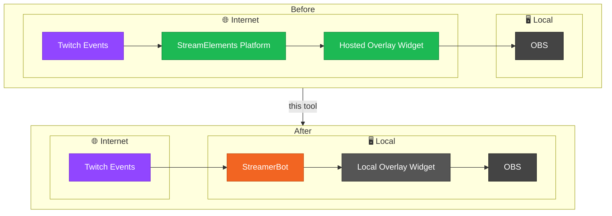

# Technical Reference

This page covers technical details and the implementation behind the generated `streamerBotApiAndEventBridge.js` and `sessionData.js` files. For the high-level overview, see the [main README](../README.md#streamelements---streamerbot-api-and-event-bridge).

---

## Table of Contents
- [Technologies Used](#technologies-used)
- [Architecture](#architecture)
- [How the Bridge Works Under the Hood](#how-the-bridge-works-under-the-hood)
- [StreamElements SessionData Fields](#streamelements-sessiondata-fields)
- [Output Folder Structure](#output-folder-structure)
- [Notes](#notes)

---

## Technologies Used
- C# .NET 8.0
- WPF
- Sqlite
- WebView2
- Html, JavaScript, CSS

---

## Architecture



---

## How the Bridge Works Under the Hood

- **API interceptors** catches your widget's `fetch()` calls and reroutes them so the widget's original code doesn't need to change:
  - Calls to the StreamElements API (e.g. channel info, counters) are rerouted to the StreamerBot WebSocket API.
  - Calls to the `Decapi API` and `unavatar.io` are cached for an hour to cut down on repeat network requests to help avoid hitting rate limits.
- **`SE_API`** reimplements the subset of the `window.SE_API` helper object that StreamElements widgets commonly use (e.g. `SE_API.store`, `SE_API.counters`, `SE_API.sanitize`), backed by StreamerBot's global variables instead of StreamElements' cloud storage.
- **Event listeners** subscribe to StreamerBot's Twitch events and translate each one into the matching StreamElements event your widget already knows how to handle:

  | StreamerBot Event | Simulated StreamElements Event |
  |---|---|
  | Follow | `follower-latest` |
  | Subscription (new) | `subscriber-latest` |
  | Subscription (resub) | `subscriber-latest` |
  | Gift Sub (individual) | `subscriber-latest` |
  | Gift Bomb (community) | `subscriber-latest` |
  | Cheer (bits) | `cheer-latest` |
  | Raid | `raid-latest` |
  | Reward Redemption | `event` (`channelPointsRedemption`) |
  | Chat Message | `message` |
  | Chat Message Deleted | `delete-message` |

  > Hosting, tips, and a few other legacy StreamElements events aren't supported, as they're either no longer part of Twitch (e.g. hosting) or have no StreamerBot equivalent.

> **Note — Third-party scripts:** The generated bridge file imports the following libraries at runtime:
  - [jQuery](https://jquery.com/) — DOM utilities used by many SE widgets.
  - [StreamerBot Client](https://github.com/StreamerBot/client) — official JS client for the StreamerBot WebSocket Server and API.
  - [profanity-cleaner](https://www.npmjs.com/package/profanity-cleaner) — used by the `SE_API.sanitize` implementation to filter chat message content.

---

## StreamElements SessionData Fields

Only a subset of the full SE SessionData schema currently carries real data — everything else in `SESSION` is initialized to an empty/zero default so widget code referencing it won't throw errors, it just won't update.

**Follower Data:**
| SessionData Key | What It Tracks | Source | Survives a Refresh? |
|---|---|---|---|
| `follower-total` | Current total follower count | StreamerBot (`EmitTwitchChannelStats`) | ✅ Yes |
| `follower-latest` | Most recent follower's name | StreamerBot (`EmitTwitchChannelStats`) | ✅ Yes |
| `follower-goal` | Follower goal target | StreamerBot (`Twitch-FetchGoals`) | ✅ Yes |
| `follower-session` | Followers gained this browser session | In-memory counter, incremented as Follow events come in | ❌ No |

**Subscriber Data:**
| SessionData Key | What It Tracks | Source | Survives a Refresh? |
|---|---|---|---|
| `subscriber-total` | Current total subscriber count | StreamerBot (`EmitTwitchChannelStats`) | ✅ Yes |
| `subscriber-latest` | Most recent subscriber's name | StreamerBot (`EmitTwitchChannelStats`) | ✅ Yes |
| `subscriber-goal` | Subscriber goal target | StreamerBot (`Twitch-FetchGoals`) | ✅ Yes |
| `subscriber-session` | All subs gained this session (new + resub + gifted) | In-memory counter | ❌ No |
| `subscriber-new-session` | New subs this session | In-memory counter | ❌ No |
| `subscriber-resub-session` | Resubs this session | In-memory counter | ❌ No |
| `subscriber-gifted-session` | Gift subs this session | In-memory counter | ❌ No |

**Cheer Data:**
| SessionData Key | What It Tracks | Source | Survives a Refresh? |
|---|---|---|---|
| `cheer-goal` | Bits/cheer goal target | StreamerBot (`Twitch-FetchGoals`) | ✅ Yes |
| `cheer-session` | Bits cheered this session | In-memory counter | ❌ No |

> **Note — why the session counters reset:** the `-session` counters live only in the widget's in-memory `SESSION` object so refreshing the widget's page resets them back to zero. The `-total` and `-goal` values above don't have this problem, since they're fetched from StreamerBot.

---

## Output Folder Structure

```
Documents/
└── imA-SB-Widgets/
    └── widget1/
        ├── index.html
        ├── index.js
        ├── index.css
        ├── config.js
        ├── sessionData.js
        ├── streamerBotApiAndEventBridge.js
        ├── Images/
        │   └── ...image asset files
        ├── Audio/
        │   └── ...audio asset files
        └── Video/
            └── ...video asset files
```

> Asset folders (`Images`, `Audio`, `Video`) are only created if widget includes files of that type.

---

## Notes

- **SE template variables** — `{{variableName}}` and `{variableName}` placeholders in your HTML and CSS are replaced at generation time using values from your `data.json`.
- **Protocol-relative URLs** — Any `src="//..."` or `href="//..."` references in your HTML are automatically upgraded to `https://` to avoid mixed-content issues.
- **Multiple `.json` files are allowed** — the tool accepts more than one `.json` file, unlike `.html`, `.css`, and `.js` where only one of each is permitted.
- **Supported asset formats** — the following file types are recognized on import; other extensions will not be picked up:
  - **Image:** `.jpg`, `.jpeg`, `.png`, `.gif`, `.webp`, `.svg`, `.bmp`, `.ico`
  - **Audio:** `.mp3`, `.wav`, `.m4a`, `.aac`
  - **Video:** `.mp4`, `.webm`
