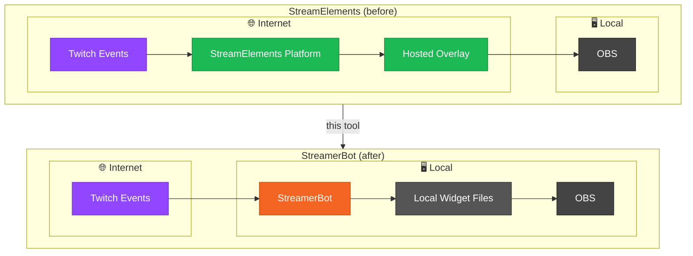

# SE Overlay Migration Tool

A desktop utility for migrating StreamElements overlay widgets to [StreamerBot](https://streamer.bot/), making your existing overlays compatible with StreamerBot's event system without having to rebuild them from scratch.

---

## Overview

StreamElements hosts overlays and services them with stream events out of the box. StreamerBot can service apps with events too, but has no native overlay system of its own.

This tool migrates your existing SE overlays so they live locally on your machine and can be served by StreamerBot instead — keeping your overlays working without rebuilding them from scratch.

---

## Architecture



---

## Features

### SE to StreamerBot Migration
Takes your existing StreamElements overlay files and converts them into a locally-hosted widget that StreamerBot can drive with events. No manual code changes needed.

### Widget Management
- Create and name multiple widgets in a single session.
- Remove widgets you no longer need.
- Each widget tracks its own file set and deploy path independently.

### File Import & Validation
- Import `.html`, `.js`, `.css`, and `.json` files via a file picker.
- Warns if the required `.html` file is missing or if duplicate files exist for the same extension.
- The **Generate** button stays disabled until the file set is valid.

### StreamerBot Event Bridge
A `streamerBotEvents.js` file is generated automatically alongside your widget files. This bridges StreamerBot's event system to your overlay so it can respond to stream events (follows, subs, etc.) without any manual wiring.

### Deploy Path
- The deploy path is shown in the UI and can be copied to your clipboard with one click.

---

## How to Get Started

### Step 1 — Create a widget
Click **+ New Widget** in the left panel. A widget entry appears with a default name.

### Step 2 — Name it (optional)
Edit the name in the text field at the top and click **Save**.

### Step 3 — Import your StreamElements files
Click **Import** and select your overlay files. You'll typically need:
- `widget.html` (required)
- `widget.css`
- `widget.js`
- `data.json` and/or `fields.json`

### Step 4 — Fix any warnings
If the warning banner appears, follow its instructions (e.g. add the missing HTML file, or remove a duplicate). The Generate button will remain disabled until the file set is clean.

### Step 5 — Generate
Click **Generate**. The tool writes the processed files to the deploy path shown under **Deploy Location**.

### Step 6 — Add to OBS
Copy the deploy URL and create a browser source in OBS pointing to it.

---

## Output Folder Structure

```
Documents/
└── imA-SB-Widgets/
    └── widget1/
        ├── index.html
        ├── index.js
        ├── index.css
        ├── config.js
        └── streamerBotEvents.js
```

---

## Notes

- **Multiple `.json` files are allowed** — the tool accepts more than one `.json` file, unlike `.html`, `.css`, and `.js` where only one of each is permitted.
- **SE template variables** — `{{variableName}}` and `{variableName}` placeholders in your HTML and CSS are replaced at generation time using values from your `data.json`.
- **Protocol-relative URLs** — Any `src="//..."` or `href="//..."` references in your HTML are automatically upgraded to `https://` to avoid mixed-content issues.
