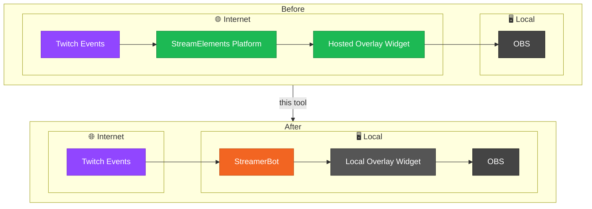

# SE2SB Overlay Migrator

A desktop utility for migrating StreamElements overlay widgets to [StreamerBot](https://streamer.bot/), making your existing overlays compatible with StreamerBot's event system without having to rebuild them from scratch.

---

## Overview

StreamElements hosts overlays and services them with stream events out of the box. StreamerBot can service apps with events too, but has no native overlay system of its own.

This tool migrates your existing SE overlays so they live locally on your machine and can be served by StreamerBot instead — keeping your overlays working without rebuilding them from scratch.


---

## Architecture



---

## Features

### SE to StreamerBot Migration
- Takes your existing StreamElements overlay widget and converts them into a locally-hosted overlay widget that StreamerBot can drive with events.
- No manual code changes needed.

### Widget Management
- Create and configure multiple widgets.
- Each widget tracks its own files and configurations independently.
- Tweak configuration settings and see your changes in the live preview.

### StreamerBot Event Bridge
- A `streamerBotEvents.js` file is generated automatically alongside your widget files. This bridges StreamerBot's event system to your overlay so it can respond to stream events (follows, subs, etc.) without any manual wiring.

### Simple File Imports
- Import `.html`, `.js`, `.css`, `.json` files or even an entire folder or `.zip` file.
- Warns if the required files are missing or if duplicate files exist.

### One-Click!
- Just one click to copy URL and add to OBS as a browser source.

### Misc
- Easily check for newer version and update!
- Switch between light and dark themes.

---

## Setting Up the StreamerBot WebSocket Server

This tool communicates with StreamerBot via its built-in WebSocket server. You'll need to enable and start it before generating or using any widgets.

### Step 1 — Open the WebSocket Server settings
In StreamerBot, navigate to **Servers/Clients** → **WebSocket Server**.


### Step 2 — Enable Auto Start
Check the **Auto Start** option. This ensures the WebSocket server starts automatically every time StreamerBot launches, so your overlays are always ready without any manual steps.

### Step 3 — Start the server
Click **Start Server**. The server status should update to show it's running.


The WebSocket Server is now running.


> **Note:** The default host and port (`127.0.0.1:8080`) are what this tool expects. Only change these if you have a conflict with another application, and update the connection settings in this tool to match.

---

## Exporting Your Widget Files from StreamElements

Before importing into SE2SB, you need to export your widget's source files from StreamElements manually.

### Step 1 — Open your overlay in the editor

In StreamElements, navigate to your overlay and open it in the editor. In the left panel, click **Settings**, then click **Open Editor**.


### Step 2 — Copy each tab's contents into a file

The editor has five tabs along the top: **HTML**, **CSS**, **JS**, **Fields**, and **Data**. For each tab, click it, select all the contents, and paste them each into new individual file with the corresponding file name and extension below:

| Tab | Save as |
|-----|---------|
| HTML | `widget.html` |
| CSS | `widget.css` |
| JS | `widget.js` |
| Fields | `fields.json` |
| Data | `data.json` |

> **Note:** The files can be named anything you like as long as the extensions are correct.


### Step 3 — Proceed to import

Once you have your files saved, follow the steps below to import them into the tool.

---

## How to Get Started with the SE2SB Overlay Migrator

### Step 1 — Create a widget
Click **+ New Widget** in the left panel. A widget entry appears with a default name.

### Step 2 — Import your widget files
Click **Import** and select your overlay files. You'll typically need:
- `widget.html` (required)
- `widget.css`
- `widget.js`
- `fields.json` and `data.json`

### Step 3 — Fix any warnings
If the warning banner appears, follow its instructions (e.g. add the missing HTML file, or remove a duplicate). The Generate button will remain disabled until the file set is ready.

### Step 4 — Save your work
Click **Save**.

### Step 6 — Edit Configuration (optional)
Click **Edit Configuration**. Configure the widget settings as needed.

### Step 7 — Generate
Click **Generate**. The tool writes the processed files to the path shown under **Deploy Location**.

### Step 8 — Add to OBS
Copy the URL and create a local browser source in OBS pointing to it.


---

## Output Folder Structure

```
Documents/
└── imA-SB-Widgets/
    └── widget1/
        ├── index.html
        ├── index.js
        ├── index.css
        ├── config.js
        └── streamerBotEvents.js
```

---

## Notes

- **Multiple `.json` files are allowed** — the tool accepts more than one `.json` file, unlike `.html`, `.css`, and `.js` where only one of each is permitted.
- **SE template variables** — `{{variableName}}` and `{variableName}` placeholders in your HTML and CSS are replaced at generation time using values from your `data.json`.
- **Protocol-relative URLs** — Any `src="//..."` or `href="//..."` references in your HTML are automatically upgraded to `https://` to avoid mixed-content issues.