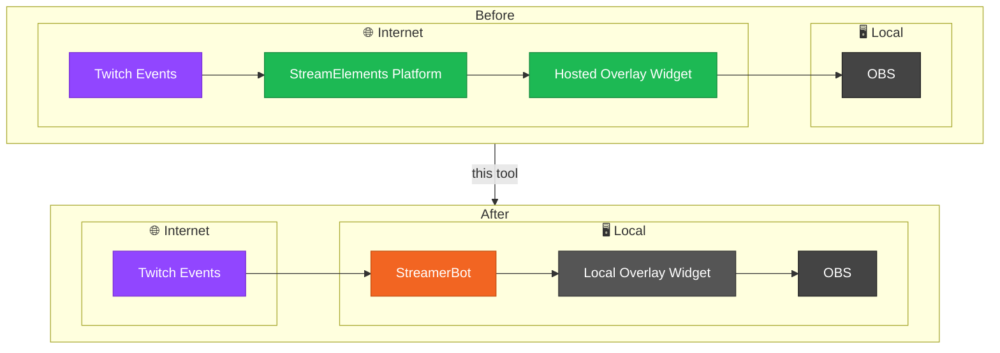
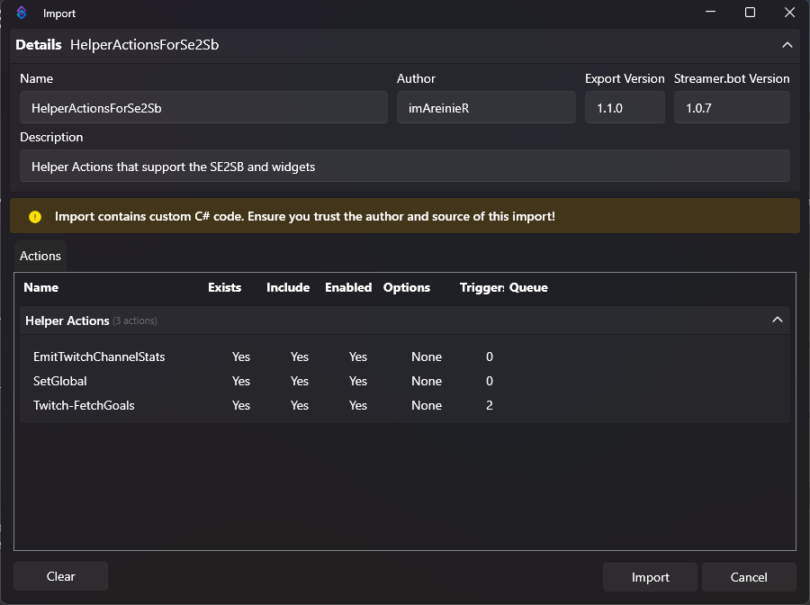
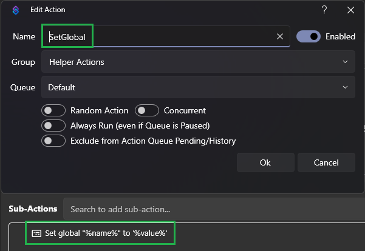

# SE2SB Overlay Migrator

A desktop utility for migrating StreamElements overlay widgets to [StreamerBot](https://streamer.bot/) - keep your overlays functional without rebuilding them from scratch!

---

## Overview

StreamElements hosts overlays and services them with stream events out of the box. StreamerBot can drive apps with events too, but has no native overlay system of its own.

This tool converts your existing SE overlays to run locally on your machine, wiring them up to StreamerBot instead.


---

## Architecture



---

## Features

### SE to StreamerBot Migration
- Takes your existing StreamElements overlay widget and converts them into a locally-hosted overlay widget that StreamerBot can drive with events.
- No manual code changes needed.

### Widget Management
- Create and configure multiple widgets.
- Each widget tracks its own files and configurations independently.
- Adjust configuration settings and see your changes in the live preview.
- Test your widget with simulated events without needing to trigger real Twitch events.

### StreamElements -> StreamerBot API and Event Bridge
- A `streamerBotApiAndEventBridge.js` file is generated automatically alongside your widget files.
- This reroutes calls to the [SE API](https://dev.streamelements.com/docs/api-docs) to the [StreamerBot API](https://docs.streamer.bot/api/websocket/requests) and listens for StreamerBot events, re-emitting them as SE events that your widget can understand.
- It also uses the [Decapi API](https://docs.decapi.me/) to supplement calls with data from Twitch and caches responses to minimize duplicate calls.

**How the bridge works under the hood:**
- **API interceptors** catches your widget's `fetch()` calls and reroutes them so the widget's original code doesn't need to change:
  - Calls to the StreamElements API (e.g. channel info, counters) are rerouted to the StreamerBot WebSocket API.
  - Calls to the `Decapi API` and `unavatar.io` are cached for an hour to cut down on repeat network requests to help avoid hitting rate limits.
- **`SE_API`** reimplements the subset of the `window.SE_API` helper object that StreamElements widgets commonly use (e.g. `SE_API.store`, `SE_API.counters`, `SE_API.sanitize`), backed by StreamerBot's global variables instead of StreamElements' cloud storage.
- **Event listeners** subscribe to StreamerBot's Twitch events and translate each one into the matching StreamElements event your widget already knows how to handle:

  | StreamerBot Event | Simulated StreamElements Event |
  |---|---|
  | Follow | `follower-latest` |
  | Subscription (new) | `subscriber-latest` |
  | Subscription (resub) | `subscriber-latest` |
  | Gift Sub (individual) | `subscriber-latest` |
  | Gift Bomb (community) | `subscriber-latest` |
  | Cheer (bits) | `cheer-latest` |
  | Raid | `raid-latest` |
  | Reward Redemption | `event` (`channelPointsRedemption`) |
  | Chat Message | `message` |
  | Chat Message Deleted | `delete-message` |

  > Hosting, tips, and a few other legacy StreamElements events aren't supported, as they're either no longer part of Twitch (e.g. hosting) or have no StreamerBot equivalent.

> **Note — Third-party scripts:** The generated bridge file imports the following libraries at runtime:
  - [jQuery](https://jquery.com/) — DOM utilities used by many SE widgets.
  - [StreamerBot Client](https://github.com/StreamerBot/client) — official JS client for the StreamerBot WebSocket Server and API.
  - [profanity-cleaner](https://www.npmjs.com/package/profanity-cleaner) — used by the `SE_API.sanitize` implementation to filter chat message content.

### Simple File Imports
- Import `.html`, `.js`, `.css`, `.json` files or even an entire folder or `.zip` file.
- Warns if `.html` is missing or if more than one file shares the same extension.

### One-Click!
- Just one click to copy the URL and add to OBS as a browser source.

### Misc
- Easily check for newer version and update!
- Automatic backup of your data locally!
- Switch between light and dark themes.

---

## Setting Up the StreamerBot WebSocket Server

This tool communicates with StreamerBot via its built-in WebSocket server. You'll need to enable and start it before generating or using any widgets.

### Step 1 — Open the WebSocket Server settings
In StreamerBot, navigate to **Servers/Clients** → **WebSocket Server**.


### Step 2 — Enable Auto Start
Check the **Auto Start** option. This ensures the WebSocket server starts automatically every time StreamerBot launches, so your overlays are always ready without any manual steps.

### Step 3 — Start the server
Click **Start Server**. The server status should update to show it's running.


The WebSocket Server is now running.


> **Note:** The default host and port (`127.0.0.1:8080`) are what this tool expects. Only change these if you have a conflict with another application, and update the connection settings in this tool to match.

---

## Importing `SetGlobal` StreamerBot Action

> **Prerequisite:** This Action is required for widgets that use `SE_API.store.set()` to save values. Without it, those calls will silently do nothing.

A SetGlobal Action is required for `SE_API.store.set()` to work correctly. You will only need to import this once.

### Step 1 — Open the Import dialog
In StreamerBot, navigate to **Actions** and right-click anywhere in the actions list. Select **Import**.

### Step 2 — Import the Action
Paste the import string below into the text field, then click **Import**.

**Import string:**
```
U0JBRR+LCAAAAAAABAB1VE1vozAQvVfqf7CQcisREBqS3qJK2+5ltWpXe6l6MHhIrBqb9Uc+VOW/r40hCYFwiOJ5zzPjec/+vr9DKKhA4+AJfbuFXXJcgV0G76BfmMgxWxWaCh48tDg2eiOkY9BqJYFyCm8ncAtSObJF42k0jU4AAVVIWusW9DmRFggzJnZIgdaUr5GviLZYUpwzUJdVxZvhbS9PiBvGOqyyPVSm+nuq7UCHHRtGQHDvgLjJoWzkw0dQBzUwJa7BLEmT8nE+D6MszsM0XSThMlmkYUbyWVrOo2Wc5l1zzbZ/Bkwzt6j9wpGf7uvtBO6O6qpqaaCH7AtmCPyQonqlSgt5sKQSM3WL9Rs4sWMcYw1k7fWwlsLUDn4FVoNEq3ZGlxzMdvigrAhj6SXmRFQneQZ4IXhhpASux1At6Xpt5XOafF4CyuSroVxXknUGsw7Cbf3o4QruHPWrHcPEzWMSXNNq5yGlx9Tw/QgjCxgvwLz+k+bfMLVz8J9DDTcye9sVOY6W86IMk3JWhmmRJuFiEeUhlBnEkD2SKMkGmXdA1xs3V3vhrjHtK8ZJMjgqdmr8JP3LdIJvutJ3ywnsXcXL+PG8+OxrzxiuFZAX5zIvcge3ezq+v0Y9H9jtVWXd1Q/uIFei+AL9DnJ75Zwz+MyoPWMf1LTq+BdvxPnhSmY+AvtaSOsEd6+69yz1sx++OP61CzGrN3gaB/d3x/8yi2myXAUAAA==
```



### Step 3 — Confirm the Action appears
After importing, you should see the **SE2SB — Set Global Variable** Action in your actions list. No additional configuration is needed.



---

## Exporting Your Widget Files from StreamElements

Before importing into SE2SB, you need to export your widget's source files from StreamElements manually.

### Step 1 — Open your overlay in the editor

In StreamElements, navigate to your overlay and open it in the editor. In the left panel, click **Settings**, then click **Open Editor**.


### Step 2 — Copy each tab's contents into a file

The editor has five tabs along the top: **HTML**, **CSS**, **JS**, **Fields**, and **Data**. For each tab, click it, select all the contents, and paste them each into new individual file with the corresponding file name and extension below:

| Tab | Save as |
|-----|---------|
| HTML | `widget.html` |
| CSS | `widget.css` |
| JS | `widget.js` |
| Fields | `fields.json` |
| Data | `data.json` |

> **Note:** The files can be named anything you like as long as the extensions are correct.


### Step 3 — Proceed to import

Once you have your files saved, follow the steps below to import them into the tool.

---

## How to Get Started with the SE2SB Overlay Migrator

### Step 1 — Create a widget
Click **+ New Widget** in the left panel. A widget entry appears with a default name.

### Step 2 — Import your widget files
Click **Import** and select your overlay files. You'll typically need:
- `widget.html` (required)
- `widget.css`
- `widget.js`
- `fields.json` and `data.json`

### Step 3 — Fix any warnings
If the warning banner appears, follow its instructions (e.g. add the missing HTML file, or remove a duplicate). The Generate button will remain disabled until the file set is ready.

### Step 4 — Save your work
Click **Save**.

### Step 5 — Edit Configuration (optional)
Click **Edit Configuration**. Configure the widget settings as needed.

### Step 6 — Generate
Click **Generate**. The tool writes the processed files to the path shown under **Deploy Location**.

### Step 7 — Add to OBS
Copy the URL and create a local browser source in OBS pointing to it.


---

## Output Folder Structure

```
Documents/
└── imA-SB-Widgets/
    └── widget1/
        ├── index.html
        ├── index.js
        ├── index.css
        ├── config.js
        └── streamerBotApiAndEventBridge.js
```

---

## Notes

- **SE template variables** — `{{variableName}}` and `{variableName}` placeholders in your HTML and CSS are replaced at generation time using values from your `data.json`.
- **Protocol-relative URLs** — Any `src="//..."` or `href="//..."` references in your HTML are automatically upgraded to `https://` to avoid mixed-content issues.
- **Multiple `.json` files are allowed** — the tool accepts more than one `.json` file, unlike `.html`, `.css`, and `.js` where only one of each is permitted.