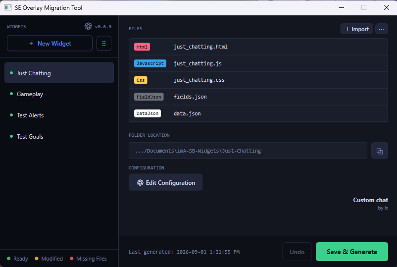
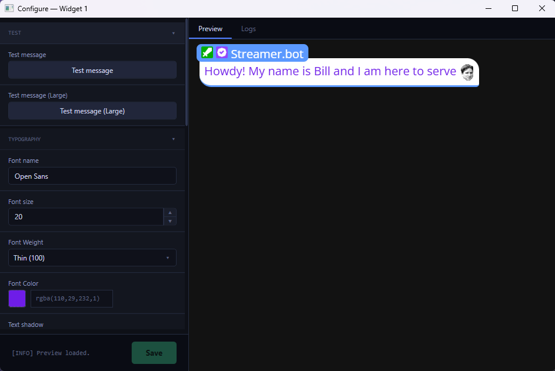
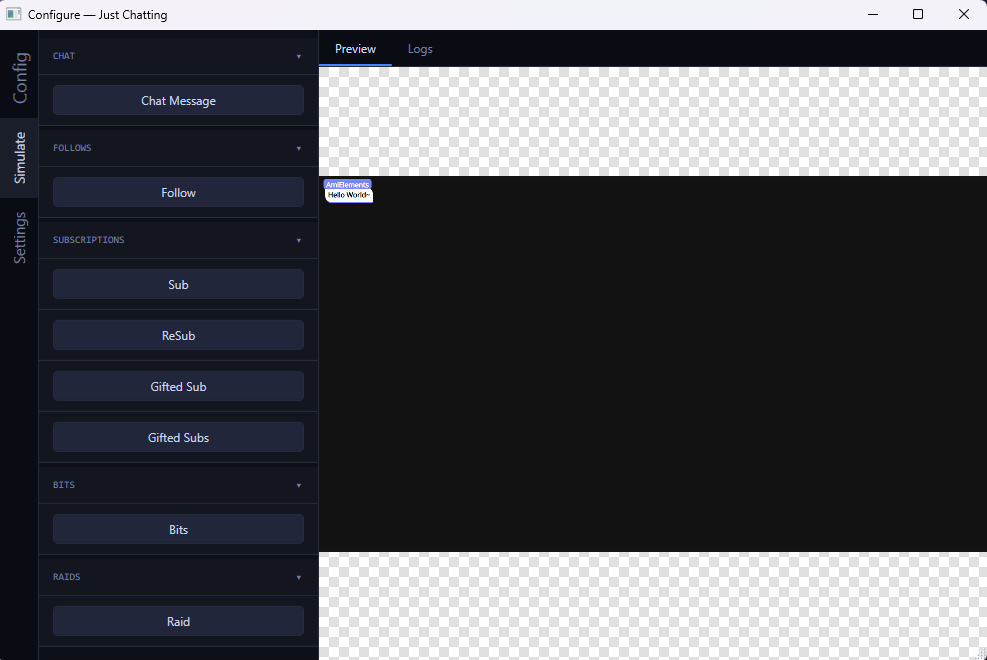
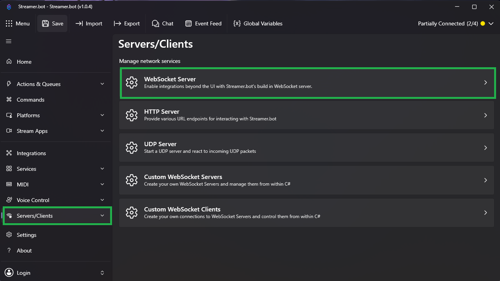
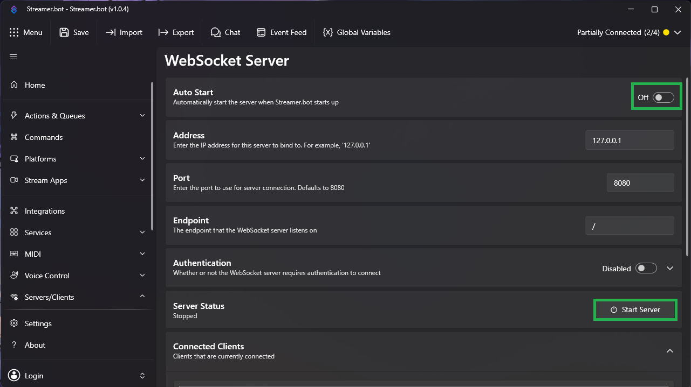
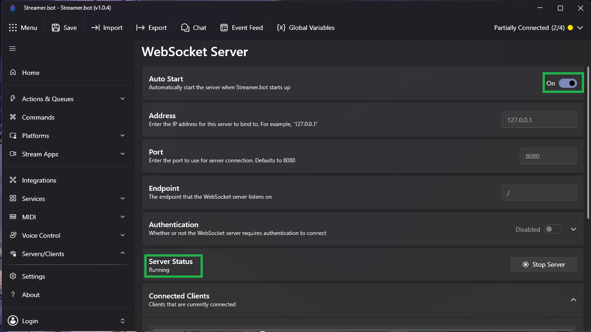
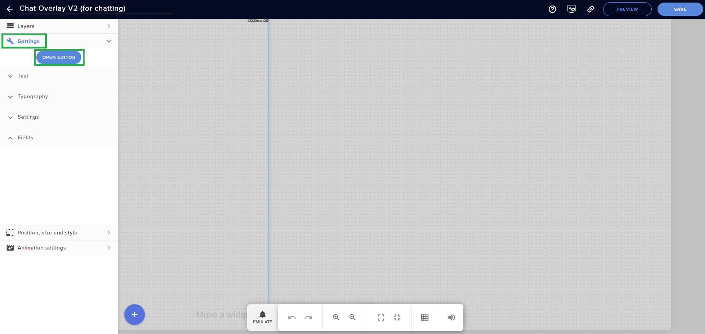
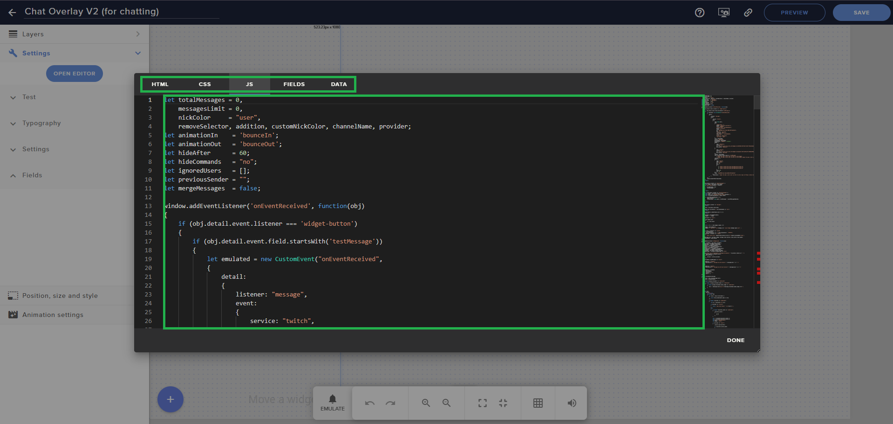
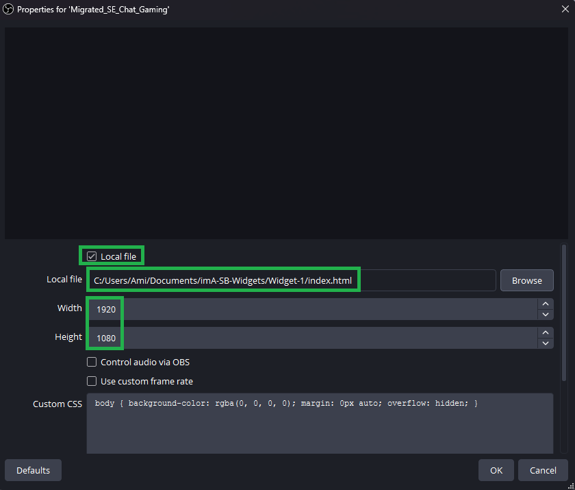

# SE2SB Overlay Migrator

A desktop utility for migrating StreamElements overlay widgets to [StreamerBot](https://streamer.bot/) - keep your overlays functional without rebuilding them from scratch!

---

## Table of Contents
- [Overview](#overview)
- [Features](#features)
- [Download / Installation](#download--installation)
- [Setting Up StreamerBot WebSocket Server](#setting-up-streamerbot-websocket-server)
- [Importing SE2SB Helper Actions](#importing-se2sb-helper-actions)
- [Exporting Widget Files from StreamElements](#exporting-widget-files-from-streamelements)
- [Getting Started with SE2SB Overlay Migrator](#getting-started-with-se2sb-overlay-migrator)
- [Notes](#notes)
- [Disclaimer](#disclaimer)

---

## Overview

StreamElements hosts overlays and services them with stream events out of the box. StreamerBot can drive apps with events too, but has no native overlay system of its own.

This tool converts your existing SE overlays to run locally on your machine, wiring them up to StreamerBot instead.







---

## Features

### SE to StreamerBot Migration
- Takes your existing StreamElements overlay widget and converts them into a locally-hosted overlay widget that StreamerBot can drive with events.
- No manual code changes needed.

### Widget Management
- Create and configure multiple widgets.
- Each widget tracks its own files and configurations independently.
- Adjust configuration settings and see your changes in the live preview.
- Test your widget with simulated events without needing to trigger real Twitch events.

### StreamElements -> StreamerBot API and Event Bridge
- A `streamerBotApiAndEventBridge.js` file is generated automatically alongside your widget files.
- This reroutes calls to the [SE API](https://dev.streamelements.com/docs/api-docs) to the [StreamerBot API](https://docs.streamer.bot/api/websocket/requests) and listens for StreamerBot events, re-emitting them as SE events that your widget can understand.
- It also uses the [Decapi API](https://docs.decapi.me/) to supplement calls with data from Twitch and caches responses to minimize duplicate calls.

> **For details on how the bridge works under the hood** (API interceptors, the `SE_API` shim, and the StreamerBot → StreamElements event map), see [docs/bridge-and-session-data.md](docs/bridge-and-session-data.md#how-the-bridge-works-under-the-hood).

### StreamElements SessionData Replication
- A `sessionData.js` file is generated alongside your widget files and loaded before the bridge, giving your widget the same `SESSION` object shape that many SE widgets read from (`onWidgetLoad` and `onSessionUpdate` events both include it).
- On load, the widget asks StreamerBot for your current stats (via the `EmitTwitchChannelStats` Helper Action — see [Importing the SE2SB Helper Actions](#importing-the-se2sb-helper-actions)) and uses the response to populate the SessionData fields below.
- Only a subset of the full SE SessionData schema currently carries real data — everything else in `SESSION` is initialized to an empty/zero default so widget code referencing it won't throw errors, it just won't update.

> **For the full list of SessionData fields and where each one comes from**, see [docs/bridge-and-session-data.md](docs/bridge-and-session-data.md#streamelements-sessiondata-fields).

### Simple File Imports
- Import `.html`, `.js`, `.css`, `.json`, images, audio, and video files or even an entire folder or `.zip` file.
- Warns if `.html` is missing or if more than one file shares the same extension.

> **Note:** Only a limited set of common formats is supported — see [Notes](#notes).

### One-Click!
- Just one click to copy the URL and add to OBS as a browser source.

### Misc
- Easily check for newer version and update!
- Automatic backup of your data locally!
- Switch between light and dark themes!

---

## Download / Installation

1. Head to the [Releases](../../releases/latest) page.
2. Download the latest zip.
3. Extract the zip file
4. Run `SE2SB Overlay Migrator.exe`

That's it — no other setup is required to run the tool itself. Before generating or using widgets, make sure StreamerBot's WebSocket server is enabled (see [Setting Up the StreamerBot WebSocket Server](#setting-up-the-streamerbot-websocket-server)).

---

## Setting Up StreamerBot WebSocket Server

This tool communicates with StreamerBot via its built-in WebSocket server. You'll need to enable and start it before generating or using any widgets.

### Step 1 — Open the WebSocket Server settings
In StreamerBot, navigate to **Servers/Clients** → **WebSocket Server**.



### Step 2 — Enable Auto Start
Check the **Auto Start** option. This ensures the WebSocket server starts automatically every time StreamerBot launches, so your overlays are always ready without any manual steps.

### Step 3 — Start the server
Click **Start Server**. The server status should update to show it's running.



The WebSocket Server is now running.


> **Note:** The default host and port (`127.0.0.1:8080`) are what this tool expects. Only change these if you have a conflict with another application, and update the connection settings in this tool to match.

---

## Importing SE2SB Helper Actions

> **Prerequisite:** These Actions are required for widgets that use `SE_API.store.set()` and the [SessionData replication](#streamelements-sessiondata-replication) described above. Without them, those features will silently do nothing. You will only need to import them once.

A single import now brings in a **Helper Actions** group containing 3 Actions:

| Action | Purpose |
|---|---|
| `EmitTwitchChannelStats` | Fetches your current follower/subscriber totals and latest follower/subscriber, then sends them back to the widget on load to populate SessionData. |
| `Twitch-FetchGoals` | Sub-action called by `EmitTwitchChannelStats` to pull your current follower, subscriber, and bits goal targets. |
| `SetGlobal` | Backs `SE_API.store.set()` calls so widgets can persist values as StreamerBot global variables. |

### Step 1 — Open the Import dialog
In StreamerBot, navigate to **Actions** and right-click anywhere in the actions list. Select **Import**.

### Step 2 — Import the Actions
Paste the import string below into the text field, then click **Import**.

**Import string:**
```
U0JBRR+LCAAAAAAABADdOltv6kjS7yvtf0BHmqcZR74C/qR9AA4YnIQTTDDGm3nom8GhjVlsIGQ1//2rtjHB4JxLNDO7s0fyIXZVu+7VVdX+99//Vqt9iliKPv1f7d/iBm5XKGJw+6nP+JptWiQN41XSizdjpo7xp1+OWGibLuKNwAuj1oaFq5A5J+CObRJYJaDKjXIjnwCUJWQTrtMjMCdRO9KopQuU1pLteh1vUrhhtXFXHbdraEVr+5DOWZqck4+d7SpfCa9abTkvYBEwE20j98SEAArYbxnGJ4pK8qKcOjz5Z/6kVoAycEgFpyo2FKbrdSmoY1PSDZ1IuKmrUpMqlNWJwhA1CuayZf/asm2mRvn4T6r4r/hXWslWCHMmqKabLStBXgjfUtbbxFE/TNJ4cwCkAPHkPawHtqLhal6FVVi5G4Xp4z5MyaKzQKsV4+MUvek5Q51v4u362lwlHMT36JCARapobcCCcXSy1RWcxCuy3WzYKq2CpptwPgdbCgP9eg5Itrh1bbsL+53ZsK5qRqCRJhjNwJIurGkylUgyagSIMq2OUXAuVLZ0z8L5QvAl38iXsPSwFjo05OYlZI2ENANa9sxvmzjndkXZi6B4/vy3X74tIGoGATKaWEK0zkBAoyE1FYNKRr0hM00O6nrd/JiA5h8ioPKjAjY0gwaBqUmkiYikMzOQsGaCqJQxRUMqQ4r2MQHrf4iA6o8KiHGTmkhvSEpdBhetm+Cigc4ksEATm6pZZzL6mICNP0RA7fsFLBJOexMjSlDyjayTrbnYLk5Lk1q+uBbEnMd7tvkFtg0scLH4W2wY8xjxWiLeWkvj2p7hJCZLltYID0Hsa1IbFjBQCGFXySQD39w8PV1eU9BCvE+enu5DsomTOEhvht3Hp6feBkTdx5tlXX962uk38o0ma4r59BQlJN7wEN9Qzi8ZEDSenoZsn0I+E6+yk3iVIZbxfr1kHB9S1olpplvqDdc4IvOJxl+p5aZf9vJt8ewxcjVqmVuimhHtGLfwu71bvqzxqtv4PIqHnVVbmUUv69mh/Yyt3is5tD9PugsbwzMcTQCeDDthaz7otPd0aidoej+fReYOd9o9ZrnP1HP4bWdZ4Ih3wm8rv7rD0bhjTMiK933PaZOIxIPI32HrZUdV9zBSTQWvRuFdgX+62jvqjeZoasjZvXW1Zi1k7Iw48Drfun3bcFRXHnn26rZjJzPgiWiOhdWXBGuUk9BQCKwdhPsTDay58qA/lEnEt/6hfb1m6ayJJp7zL7Opwm8fQQ/zpT1S2oM77hzYhHLa7R38wzwkmhsSdXhAUxvWDXdU8H1GK5fBVGinDXofZfdVazIa4duaKlpgI9n3hvLkfP1Rvseol/rjQXKk9Ur7duYDlWveka9kPwsqik47Ouqkj9Ve4lrAB+j6hPNZzvlcCh5pglV7gXv+gjwLHxv9DPaYUJXLM3VRWu/JbzYVugJeFX+8FP5jd6YZ3Vfwt9eZZq9J31lj1SjT/zBde007oKMj/xV0Q+Q51bJ+QF5PGSqz1fAZ/GxPLb7DYU77jG7J5jTqHQb99oJNX3az6Wj+MG5vfY/Mx0szRBHEW0u+PYuTcrzlz/AgclVf+CCXL2Atc9Cxn5HV2+LITe7AJ8DvX0H/JR6yq5eEfmQm2DI137M/Q7yAbmxa6OAaVv2OwvecE/4g9Mb5O65hdhd5wz08N3Jf3mc+2XGT6hgT8sF7qmB3LZEflvb0cMoHj4U/zSLwOVgLuq2EORZ/JdbLgk2MBZ5OkmodU7DPy2ulji2D00P79lG1/+VPh3LF+gq75RfwWx1vZ3SA70qcQuaSvry2jKbm1lFN8FNnQSLwW2HHc71V4hx1P+IgK8RMN5N3MoMc63uj3IYlma9wrv2hL5eeBVnOKflzns9VwZf5jEROX9nwTud5Bn4yXg0hfhZ7yFkQd70l5MbdRHPA7sbqtgs615wdBhx/NdrmuIaFNTsFG8sC525p7GBPW1/mWRK5MvXs7aDvHOh0crJNMJJvg9E//nFVNaw3jMTROuSsonM5ljAcHaC62VT1NhlGgnbMYcmWp4+xizahqLu+hlvCqirdim4noJquBhIxNEPSVQM61qChQbdjmGZdNYnW1D9SSpri3x9STOqlYvLtptT0Eaj40Dph1BJdad4UFuC3AvS6gW+ooAujXpfkhiKav6YqmWpTlxoUa3pQl01Fx3/JBn7MUovHGPH/sZ4dav80XKEj/Stv3B1jYHhUw09CHz9dB6gYAiXpu76XxNsNYdUEeG7/n7K/rl8tRlCPeUxUenXmdgQj2ayTQFIDLZB0IkZGTWjtWNBgCmsYVFYbH4lCRVX/hJnD7xyDitpgTUUxJENB0LQrTSQhBLd1UkekGZimDPz9FWMw70alHoP/LWg8/2vnZ9+eQMhKkxCdgWVMHUl6nVKpWa8TSJZIwQppMC2oXzns0Skb12OUr3tdpuWkyAa/lnzvO6YlTMdYUYNAMqgmeG0EUlPFssRMwnRN11SsXU9LigDSr4Z2H+f1nTj5/mRXOFLmQa0VHYNfstyrrvwpW3AxGcnWFUORbEVtF6Jaax1mwxDh5kxM1KNauKrNs+2iVmTQ/85ZyO9BY3yAzB/9CRSGLL3pp+n6PzLYKZ5BUQvFujGgfWdfDR+KRpvPtKyJfhWNKzR/UDTfQ6G7VoiaDUC++B6VBRyrvny3XMOv/sMDImhyVdFQicEK/Io1B3/aW8J7EzZuZzyO1Jd11pz2zLh0LxrCyNUG3YVM++3P2OJcDEvYoT1BU4VnAxvAcS2e+u5wP5vqWweaA+wO+Uw1t37/Pr5/ba2hyThrqt+GVjQy136nDXxz+d2B1QVPd0uH+1FPwX1n7Hs9RTSrY8td+JZ7IAcDeHQXJJxnw6hTg1M0NP2T3lSs8uWgmw1cdkSdxLejAqfciHhqSfZt3oiar/74mzRCrJrJoOvq0HAq1HqfBu3bRknmC3j+7DQYA59IOQ6hwTsO847DjYeR58qo5+ygSdueeDu7yLExG1hD0L+7pV3QQTE84Y6GPOcZdd9gX3+HfRAN30ztCZ8+jPPByHH4R9fUGsbORbPoe4P4dmy4YjAG+FeDlt/F3p2v2c6NZp6b0J7NieeKIcNAxILv2RCD8NuZh5kOLRMa8PXibThkdwDvAPzPB2FrA01ppuPLpvUD/Ld9axQPlkeddxTbF4OwM/vcXjXkF3bouwecDZFGIeo7Munf1+8O5oJYyy092uFu5ah36oKDHvQ7NR+SPKhl+3kQDw9eGpLIBN6GC3g/J0u+DMaDqoFWljcmkStiYQv2HIJcr7MphTwDuoWYgqafC9+6skE2FB4aOLqPocFPwB+yQTRVe2vBB+SBDEe8m05fRF6o9hOLR4POfEFOPEy2Y2/4SKfDZ8HLRHMWtO++jlRz6Y+XFfFUYbuzgcejZa4cD3SkDWK7Y2dDHciz7Ul3OQd7rsHvll/CduOcfommJ8/vxhfwCHwV8uLEWhwgHjjottJvc/5sToVtw3Yk7OVX+dp53qmOc7CDk+VsiE3w3+Fe7Cf+GOJGNeTMP7nNIT7bRDnmF7n3yqbGc2GHkUcXSAzkIMayAauIHQ1iqFMdc/mwtMAROUrsWxk9FeIsiwcR/2jaSyDGeDGQe8gHVa9vPjX5+faN/4xWyQ9bfO2HrZgc/eThYHRhf1uAz4lhn4Kt/Tzo7+cFHOhCPHe3x8OK+cOjPL/vlP2i41XouMVP/jCeGhE+zMPHqDmfAc/I8/nAOg4dLV8MOZfil4RtyCH89TJH3oXV9u54J1vLZOXyCxxbDL0uZI+wJuw2jAedBezvg7kvBoXiMCPM7Az5RuS7njwbf4eMud+fDidon+/9yctiFrlJNljO3m1MmNcWdUS+T7Te89v33n+8ovNDhgr4Z/lnyLfHQx8S3r1HJ79CUZ94anaAUInz8KjPB8v8gOG9AW9+2Vuot4LLAaynFodHLfMhbIWTC3jloP58Dzp8RRcneQfhe7xdD2TPrnz/f/TF4YhlhuCHU/AFka+qD1q0VBY2fLR6oT99McUhT2HbfEDstPE0i4/kOHi99NdrX8x9B3zOUUik54coF7kqGJUGylALgP90WrHjLSBXH/VoTdbfrIFyee+xSnsE6goSLvjdUoFcM1z46hWveS4sBsmWv8D94UVstc3zwXIeW1d1XFFj53uA8ra/FWtZ+Z04G3TzNuwdbU5WjnHbsZdZbgo5Lct4onGPvCIH7n+GulTkKlFni6F9A2IOFiZvPFbXmyU+f4A3qMEHa69so1ONftpLRK3YT+bCj74c2q85X5f7T+X7yzUFN7+T3nV9WaWPcq+QZofpkz74Bqyh/WU8AB6INQlv3fJBB+m7IdQkz2d19TG/fUhG2O9LB4rfIZ/YB8/yyMfoPoNvH8Q+7qm9ND/0e592dnjfHSoQO7CnnmL9o3rND6V6kD/y97yv4/zQ+jLHfIxuNBT9K9QuTjDzvkIziyE361NB5mJNG/howJ6d0SO5vs2/8uGSpiNM1Loq6TJrSDrVkYSpiiVkImIagYLr5UlutvQ/erj0Ax/T5R+EDj703Wf2gs12NYgiRlHK+OHrxwOGpiCk6VJdl4mkm1SWmihgUoM1mmZDVxoG+dDxgP4nfK/3kcOB/I8CP5/vlw6JYHkUoRUtPzx9vjVmm93FsdIbsHP8tOscmIZRgS+eHL8Afvs+Wc019Ym9iI+OGRUD/+yo4ka+OWr++nviDCpLiK8X6Eb59Pe//fb/E73OjkktAAA=
```


### Step 3 — Confirm the Actions appear
After importing, you should see a **Helper Actions** group in your actions list containing all 3 Actions shown above. No additional configuration is needed.


---

## Exporting Widget Files from StreamElements

Before importing into SE2SB, you need to export your widget's source files from StreamElements. You can either do this manually or use a browser extension (like `widget.io`). The manual method is described below.

### Step 1 — Open your overlay in the editor

In StreamElements, navigate to your overlay and open it in the editor. In the left panel, click **Settings**, then click **Open Editor**.



### Step 2 — Copy each tab's contents into a file

The editor has five tabs along the top: **HTML**, **CSS**, **JS**, **Fields**, and **Data**. For each tab, click it, select all the contents, and paste them each into new individual file with the corresponding file name and extension below:

| Tab | Save as |
|-----|---------|
| HTML | `widget.html` |
| CSS | `widget.css` |
| JS | `widget.js` |
| Fields | `fields.json` |
| Data | `data.json` |

> **Note:** The files can be named anything you like as long as the extensions are correct.



### Step 3 — Proceed to import

Once you have your files saved, follow the steps below to import them into the tool.

---

## Getting Started with SE2SB Overlay Migrator

### Step 1 — Create a widget
Click **+ New Widget** in the left panel. A widget entry appears with a default name.

### Step 2 — Import your widget files
Click **Import** and select your overlay files. You'll typically need:
- `widget.html` (required)
- `widget.css`
- `widget.js`
- `fields.json` and `data.json`

> **Note:** Make sure to include any nessecary image, audio, or video files (see [supported formats](#notes))

### Step 3 — Fix any warnings
If the warning banner appears, follow its instructions (e.g. add the missing HTML file, or remove a duplicate). The **Save & Generate** button will remain disabled until the file set is ready.

### Step 4 — Save your work
Click **Save**.

### Step 5 — Edit Configuration (optional)
Click **Edit Configuration**. Configure the widget settings as needed.

### Step 6 — Generate
Click **Save & Generate**. The tool saves your chagnes and writes the processed files to the path shown under **Deploy Location**.

### Step 7 — Add to OBS
Copy the URL and create a local browser source in OBS pointing to it.


---

## Notes

- **SE template variables** — `{{variableName}}` and `{variableName}` placeholders in your HTML and CSS are replaced at generation time using values from your `data.json`.
- **Protocol-relative URLs** — Any `src="//..."` or `href="//..."` references in your HTML are automatically upgraded to `https://` to avoid mixed-content issues.
- **Multiple `.json` files are allowed** — the tool accepts more than one `.json` file, unlike `.html`, `.css`, and `.js` where only one of each is permitted.
- **Supported asset formats** — the following file types are recognized on import; other extensions will not be picked up:
  - **Image:** `.jpg`, `.jpeg`, `.png`, `.gif`, `.webp`, `.svg`, `.bmp`, `.ico`
  - **Audio:** `.mp3`, `.wav`, `.m4a`, `.aac`
  - **Video:** `.mp4`, `.webm`

---

## Disclaimer

This tool processes and runs widget code locally on your machine. Any widget code you write yourself or obtain from third-party sources online is used entirely at your own discretion and is your own responsibility. Always review code from unknown sources before running it.
